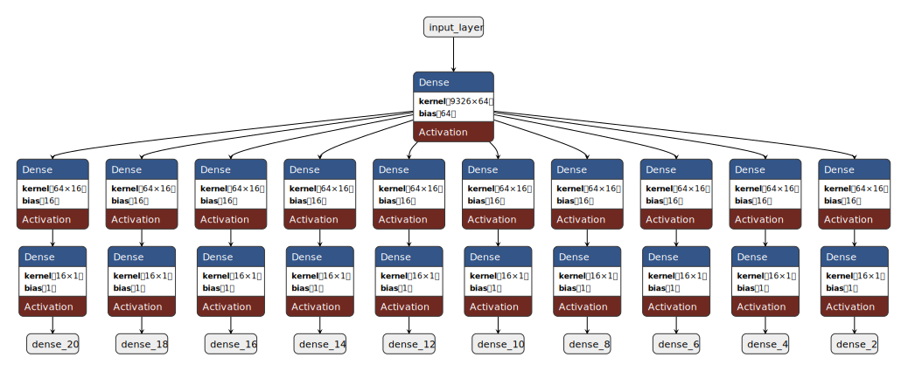

# Workflow

## Datasets

OncoMark leverages an extensive and diverse collection of datasets to train and validate its multi-task learning framework. These datasets span synthetic and real-world transcriptomics data, ensuring robust performance across diverse applications in oncology research.

The data is freely available at [**Dryad**](https://doi.org/10.5061/dryad.zw3r228jc)

### Synthetic Dataset Generation
We utilized **2.7 million single-cell transcriptomes** from 14 tumor types, collected from 922 patients across 51 studies in the **Weizmann 3CA repository**, to generate synthetic datasets for model training. Key steps include:

1. **Quality Control**:
    - Excluded cells with:
      - Mitochondrial transcript content > 15%.
      - Fewer than 200 or more than 6,000 mRNA transcripts.
    - Curated hallmark-related gene sets from multiple databases, refined through manual literature review.

2. **Hallmark Activity Scoring**:
    - Computed **Digital Scores** for 10 cancer hallmarks using the Mann-Whitney U test.
    - Used **Otsu’s thresholding** for binary classification of hallmark activity.

3. **Synthetic Biopsy Creation**:
    - Aggregated 200 hallmark-specific cells per patient sample.
    - Generated separate synthetic datasets with positive and negative ground truths for robust model training.

4. **Preprocessing**:
    - Transformed data into rank space, followed by **log2-transformation** and standardization (mean = 0, standard deviation = 1).

### External Validation Datasets
For external validation, the model was evaluated on synthetic datasets derived from five independent studies:
- **Dong et al. (2020)**, **Yost et al. (2019)**, **Pal et al. (2021)**, **Gao et al. (2021)**, **Nam et al. (2019)**  
   (95 patients in total).

Additionally, bulk transcriptomic data were collected from publicly available real-world datasets, including:

- **The Cancer Genome Atlas (TCGA)**: 6,679 samples.
- **MET500**: 868 samples.
- **POG570**: 570 samples.
- **Cancer Cell Line Encyclopedia (CCLE)**: 1,019 samples.
- **TARGET**: 734 samples.
- **PCAWG**: 1,210 samples.
- **GTEx**: 8,228 normal samples.
- **ENCODE**: 329 normal samples.

These datasets were used to evaluate the sensitivity, specificity, and generalizability of OncoMark in predicting hallmark activity.

---

## Model Training

The OncoMark framework is a multi-task neural network designed to predict hallmark activity with high fidelity. Its architecture reflects the complex interdependencies of hallmark activity in tumor biology.

### Model Architecture

 - **Input Layer**:
    - Comprises 9,326 neurons, representing preprocessed gene expression features.

 - **Shared Base Layer**:
    - A dense layer with 64 units and **ReLU activation**, capturing pan-hallmark characteristics.
    - Initialized with the **He uniform initializer** for efficient convergence.

 - **Task-Specific Layers**:
     - Each hallmark task has:
        - A dense layer with 16 units and **ReLU activation** for hallmark-specific feature learning.
        - An output layer with a single neuron and **sigmoid activation** for binary classification.

This architecture outputs probability scores for all 10 hallmark tasks simultaneously. **Binary cross-entropy loss** was computed independently for each task, and a weighted average of these losses ensured balanced learning.

### Training Procedure
1. **Dataset Preparation**:
    - A balanced dataset of **67,930 samples** with hallmark-positive and hallmark-negative samples was used.
    - Training: 57,735 samples (85%).
    - Validation: 10,195 samples (15%).
    - Train-test splits were conducted separately for each hallmark to maintain balanced representation.

2. **Optimization**:
    - **Optimizer**: Adam with a learning rate of 0.0001.
    - **Learning Rate Scheduler**: Reduced learning rate by 0.5 after 3 epochs of no improvement (minimum: 1e-6).
    - **Early Stopping**: Halted training after 6 epochs with no validation improvement.

3. **Epochs**:
    - Training conducted for **50 epochs**. Gains in validation performance became marginal, leading to early termination.

4. **Batching**:
    - Data from all hallmark tasks were merged and shuffled to avoid hallmark-specific biases and ensure uniform exposure.

### Validation and Metrics
 - External validation was conducted on **95 samples** from five independent studies.
 - Key metrics included:
    - **F1 Score**
    - **Accuracy Score**
    - **Precision and Recall**
    - **Balanced Accuracy**
    - **Precision-Recall Curve**
    - **ROC Curve**

These metrics demonstrated OncoMark's ability to generalize effectively across diverse datasets, confirming its robustness and applicability to real-world scenarios.

---

This page provides an overview of the data and methodology behind OncoMark, ensuring transparency and reproducibility for researchers and practitioners. For detailed descriptions of the model architecture, refer to the supplementary appendix.

--- 
